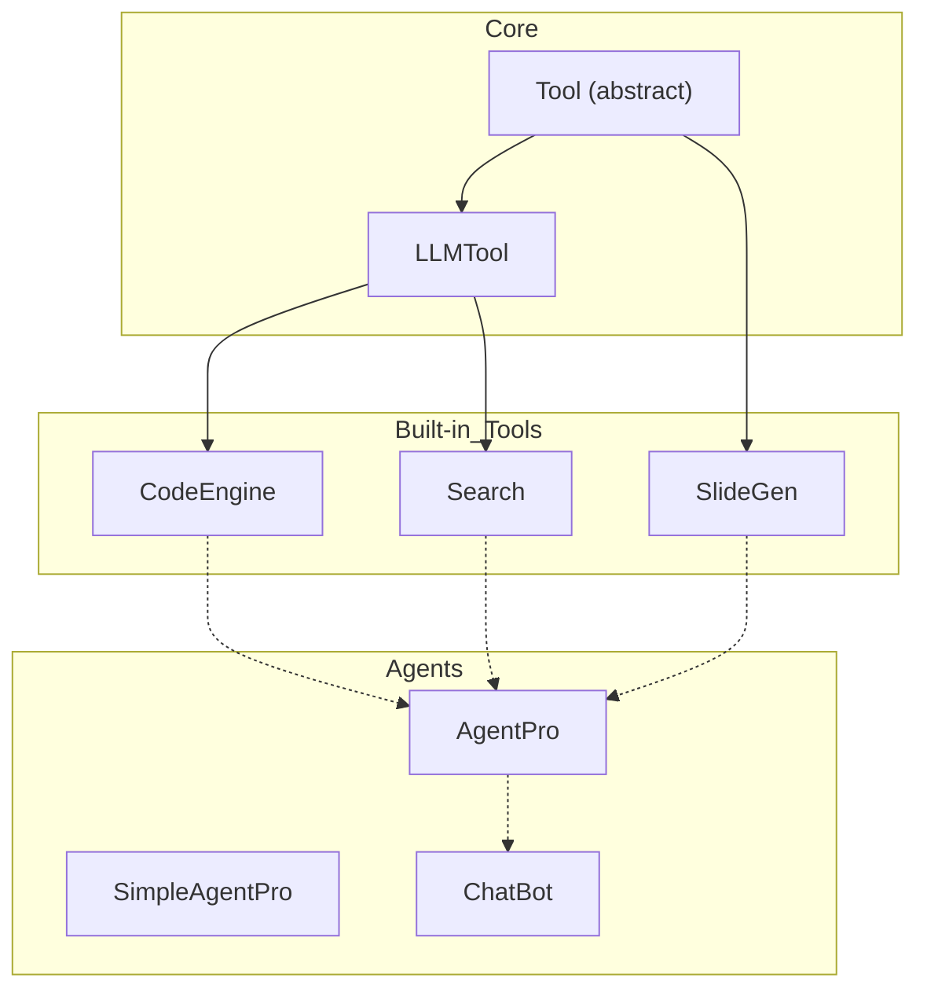

# AgentPro 🛠️🤖

*A minimal, hack-friendly ReAct-style LLM agent that can write & run code, search for knowledge, and auto-generate PowerPoint decks.*

---

## ✨ Features

| Capability                      | Tool / Class           | What it does                                                                                           |
| ------------------------------- | ---------------------- | ------------------------------------------------------------------------------------------------------ |
| **Code generation & execution** | `CodeEngine`           | Prompts GPT-4, extracts `python` blocks, auto-installs missing packages, executes the code in-process. |
| **Knowledge lookup**            | `SimplifiedSearchTool` | Asks GPT-4 for an explanatory answer; ideal for quick context gathering.                               |
| **Slide creation**              | `SlideGenerationTool`  | Converts JSON → `python-pptx` slide deck → `presentation.pptx`.                                        |
| **One-shot code agent**         | `SimpleAgentPro`       | Single API call → executes generated script → returns output.                                          |
| **Multi-tool ReAct agent**      | `AgentPro`             | Thought / Action / Observation loop with pluggable tools.                                              |
| **CLI chatbot**                 | `ChatBot`              | Tiny REPL that routes each user prompt through `AgentPro`.                                             |
| **Offline teaching demo**       | `agent_pro_demo.py`    | Dependency-free toy version (no OpenAI key needed).                                                    |

---

## 🗂️ Repo Structure

```
AgentPro_AI_Agent/
│
├─ agent_pro.py         # Full implementation (OpenAI-powered)
├─ agent_pro_demo.py    # Zero-dependency teaching version
├─ README.md            # → you are here
├─ requirements.txt     # openai, pydantic, python-pptx
└─ .gitignore
```

---

## 🚀 Quick Start

```bash
git clone https://github.com/<you>/AgentPro_AI_Agent.git
cd AgentPro_AI_Agent

# 1. Create virtual env (optional)
python -m venv .venv && source .venv/bin/activate   # Linux / macOS
# .\.venv\Scripts\activate                           # Windows

# 2. Install deps
pip install -r requirements.txt

# 3. Set your key
export OPENAI_API_KEY="sk-..."                      # PowerShell: setx OPENAI_API_KEY "sk-..."

# 4. Run the examples
python agent_pro.py
```

What you’ll see:

1. **SimpleAgentPro** generates a Matplotlib bar chart ➜ `chart.png`.
2. **AgentPro (ReAct)** searches “Python decorators” ➜ auto-builds a 3-slide `presentation.pptx`.
3. (Commented out) **ChatBot** REPL you can activate for interactive play.

No key? Run the offline demo instead:

```bash
python agent_pro_demo.py
```

---

## 🏗️ Architecture at a Glance



* ReAct prompt lists available tools ➜ GPT-4 plans actions.
* Max 10 loops, then returns **Final Answer**.

---

## 🔌 Extending

1. **Create a tool**

```python
class PDFExtractor(Tool):
    name = "pdf_extract"
    description = "Extracts structured text from a PDF file."
    arg = "Path to a PDF"

    def run(self, path: str) -> str:
        import pdfplumber, json
        with pdfplumber.open(path) as pdf:
            text = "\n".join(page.extract_text() for page in pdf.pages)
        return text
```

2. **Register it**

```python
from agent_pro import AgentPro, CodeEngine, SimplifiedSearchTool, SlideGenerationTool

agent = AgentPro(tools=[PDFExtractor(), CodeEngine(), SimplifiedSearchTool(), SlideGenerationTool()])
```

3. **Call the agent**

```python
answer = agent("Summarise the attached report and create 5 slides.")
```

---

## 🧪 Unit-Test Scaffold

```bash
pip install pytest
pytest tests/
```

*(Write your own tests in `/tests`; a starter template is provided.)*

---

## ⚠️ Caveats / Trade-offs

* **Security** – Generated code executes in-process; sandbox or review prompts in untrusted scenarios.
* **No long-term memory** – Conversation history lives only inside `self.messages`.
* **Router is LLM-driven** – Tool choice depends on GPT-4’s reasoning + system prompt wording.

---

## 📝 License

MIT – do whatever you want, just leave the copyright notice.

---

## 🙏 Credits

Built with ❤️ by \[Your Name] using OpenAI API, Pydantic, and python-pptx.
Inspired by papers on ReAct (“Reason + Act”) and countless community examples.

---

> *Clone, hack, and let us know what you build!*
